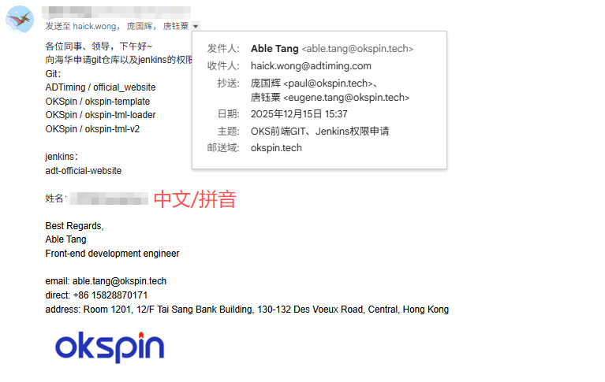
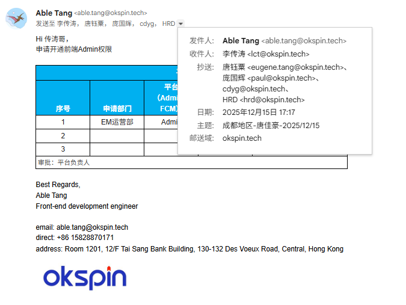
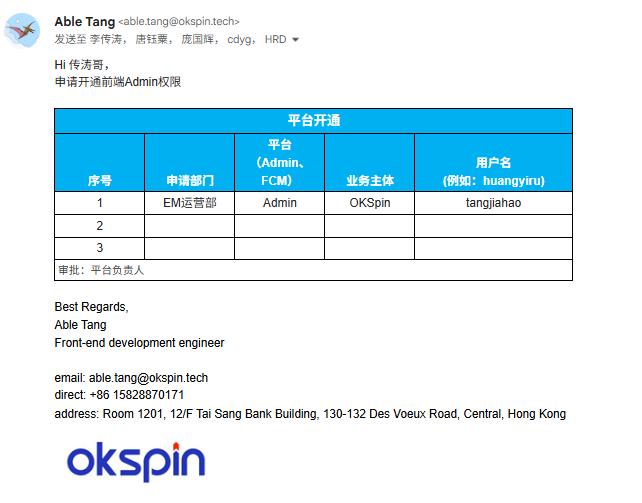

# 账号 / 权限 / 平台

本章节用于说明 **新同事在入职后需要申请和配置的账号、权限及常用平台**。  
请尽量在 **入职初期一次性申请齐全**，避免影响后续开发与发布流程。

---

## 重点账号

### Git 账号和 Jenkins 账号（重点）

:::info 账号说明

-   **GitLab 账号**
-   账号地址：<http://gitlab.adtiming.internal>
-   **Jenkins 账号**
-   账号地址：<http://jenkins.adtiming.internal/job/adt-official-website/>

:::

### 账号申请方式

-   [ ] 通过 **Google 邮箱** 发起申请（重点）
-   [ ] 参考申请图片：
        
-   [ ] **GitLab 地址账号密码** 与 **Jenkins 地址账号密码** 会发送到 **邮箱**

### 账号用途

**GitLab 账号**

-   拉取 / 提交代码
-   分支管理
-   提交 MR（合并请求）

**Jenkins 账号**

-   域名构建与发布流程查看
-   测试环境访问权限

## 需求 / 任务平台

### 账号申请方式

-   [ ] 飞书账号需 **自行注册**
-   [ ] 注册完成后，将账号提供 **粟哥**
-   [ ] 由 **粟哥** 统一分配任务、文档等相关权限
-   [ ] 飞书前端任务地址：<https://my.feishu.cn/wiki/ZwOPwWTVJiARLNkdWkrcPWICnHh?table=tblS36MyIGganDJ3&view=vewjPgBRPQ>

### 用途

-   查看企业公开文档
-   查看需求说明
-   接收和跟进制作任务

## Admin 任务管理后台

:::info 账号说明

-   **admin 账号**
-   账号地址：<https://admin.oksp.in/#/admin/publisher/template.html>

:::

### 账号申请方式

-   [ ] 通过 **Google 邮件** 发起申请（重点）
-   [ ] 参考申请图片：
        
        
-   [ ] 申请方式参考文档：<https://oivnxffoavj.feishu.cn/wiki/JRzUwts5Vi4RTfkAkJMcvCtOnNe>
-   [ ] 查看 **二、平台/邮箱开通申请 1、平台申请**
-   [ ] 审批完成后开通 admin 账号
-   [ ] 配置方式会通过 **邮箱附件** 一起发送

### 用途

-   查看需求说明
-   查看与管理任务配置
-   项目相关后台操作
-   确认交付内容

## 设计平台

### 蓝湖

-   蓝湖账号需 **自行注册**
-   注册完成后，将账号 **提供给粟哥**
-   由**粟哥**将账号加入对应设计团队

### 用途

-   查看设计稿
-   下载设计资源
-   样式与尺寸对照

## 网络与访问工具（必须）

### OpenVPN GUI（重点）

-   用途：
    -   主要用于 **仓库代码拉取与更新**
    -   访问部分公司内部资源
-   需按公司提供的配置文件完成配置

### Shadowsocks / v2rayN（工作常用）

-   用途：
    -   日常开发与资料查阅
    -   提升网络访问稳定性
-   **首次安装通常由人事协助完成**
-   后续如有不清楚的地方，可咨询前端小伙伴

---

## 权限申请清单

请确认你已具备以下权限：

-   Git 仓库 **读 read / 写 write**
-   Jenkins 发布平台查看或操作权限
-   飞书文档查看权限
-   Admin 任务管理后台查看或操作权限
-   访问蓝湖团队
-   访问网络与访问工具

> 如权限不足，请及时联系负责人补充

## 验收标准 ✅

完成以上配置后，你应当能够：

-   ✅ 正常访问 GitLab 并拉取仓库代码
-   ✅ 创建分支并 push 代码（或提交 MR）
-   ✅ 在飞书平台查看并理解需求
-   ✅ 能登录 Admin 任务管理后台
-   ✅ 知道 Jenkins 发布平台位置及基本用途
