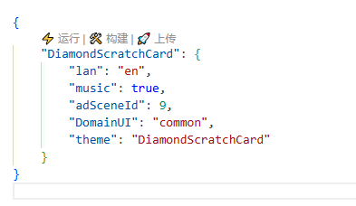
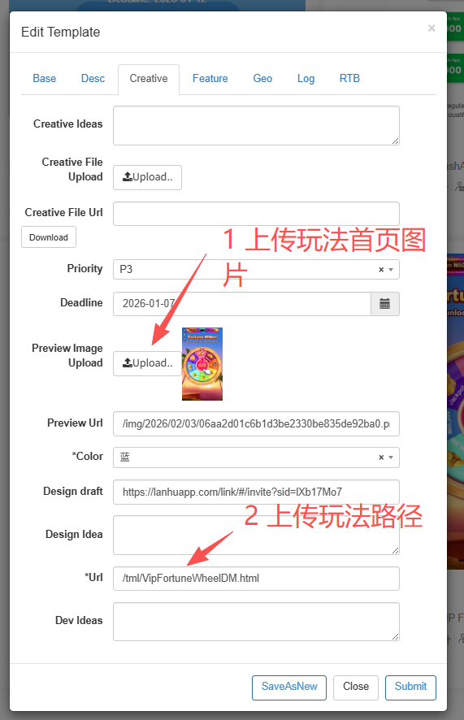

# 玩法制作

## 1. okspin-tml-v2 仓库文件目录结构

> 说明：玩法与 EndCard（EC）项目通常在 src/views/ 下创建独立目录。

```text
okspin-tml-v2/
├─ dist/                  # 构建产物目录（打包输出）
├─ src/                   # 核心业务源码目录
│  ├─ assets/             # 静态资源（图片、音频、字体等）
│  │  └─ css/             # 样式资源
│  │     ├─ common.scss   # 常规动画库
│  │     ├─ index.scss    # 样式库
│  │     └─ mixin.scss    # 背景图片、flex定位、文字边框 混入逻辑
│  ├─ components/         # 通用基础组件
│  ├─ DomainUIComponents/ # 域名 UI 组件（玩法/UI 相关）
│  ├─ util/               # 工具函数封装
│  │  ├─ HdAd.js          # 封装弹窗方法
│  │  └─ index.js         # 封装内置方法
│  └─ views/              # 项目页面 我们制作玩法、endCard（ec）主要在这个下面创建项目
├─ country.json           # 国家/地区配置数据
└─ package.json           # 项目依赖与脚本配置
```

## 2. 创建项目

### 第一步 创建项目

-   主要在 okspin-tml-v2\src\views 下面创建项目文件夹
-   玩法名称（build 变量）：推荐大驼峰/小驼峰，最终通常会体现在上线后的 xxx.html（如 DiamondScratchCard.html）
-   项目目录（dir 变量）：本地目录名，必须使用大驼峰（如 DiamondScratchCard）

```js
DiamondScratchCard/
├─ assets/              # * 静态资源
│  ├─ image/            # * 图片资源
├─ ├─ card.json         # 奖品/卡牌配置数据
│  └─ js/               # 第三方或独立脚本
├─ components/          # 业务组件（老虎机 / 转盘等）
│  ├─ SlotMachine.vue
│  └─ Turntable.vue
├─ view/                # 页面与入口组件
│  ├─ home.vue          # * 主页面
│  ├─ home.scss         # * 页面样式
│  └─ App.vue           # * 根组件
├─ build.json           # * 构建配置
└─ main.js              # * 应用入口

* 表示必填项
```

### 第二步 配置 build.json

```json
{
	"DiamondScratchCard": {
		"lan": "en",
        "showIcon": [0,1,2],
		"music": true,
		"adSceneId": 9,
		"DomainUI": "common",
		"theme": "DiamondScratchCard",
        "isExa": false,
        ...
	}
    ...
}

{
	"最终项目名称": {
		"lan": "en", // 语言（需要问运营是否是特殊语言，默认en）
        "showIcon": [0,1,2], // 显示版本的icon（根据版本来配置，默认0,1,2）
		"music": true, // 是否开启交互音乐（根据运营需求配置，默认flase，功能需要自己在home.vue写，可参考其他小伙伴项目）
		"adSceneId": 9, // SG版本 必带
		"DomainUI": "common", // 域名UI（需要问运营是否是特殊域名UI，默认common）
		"theme": "最终项目名称html", // 项目名称（可以默认不填）
        "isExa": false, // 是否是定制版本
        ...(后续内容可以自定义配置)
	}
    (有多个版本的时候，项目配置方式同上，直接在对象中添加即可)
}
```

### 第三步 配置 package.json

```json
    // 运行命令
    "serve-DiamondScratchCard": "cross-env build=DiamondScratchCard dir=RTB_DiamondScratchCard vite",

    "serve-玩法名称": "cross-env build=玩法名称 dir=项目名称 vite",
    // 玩法名称和项目名称可以相同
    // 玩法名称主要是上线后的html文件名DiamondScratchCard.html，尽量小驼峰或者大驼峰
    // 项目名称主要是本地项目目录名称，可以带短前缀区分制作人员

    // 构建命令
    "build-DiamondScratchCard": "cross-env build=DiamondScratchCard dir=RTB_DiamondScratchCard suffix=true vite build",

    "build-玩法名称": "cross-env build=玩法名称 dir=项目名称 suffix=true vite build",
    // suffix只有RTB版本需要配置

    /****** 上传命令 ******/
    // 正式
    "rsync": "node lib/s3sync.js --mode prod --src dist --dst tml --exclude=js --exclude=css",
    // 测试
    "rsync-test": "node lib/s3sync.js --mode test --src dist --dst tml --exclude=js --exclude=css",

```

## 3. 运行/构建/上传项目

### 单个项目构建与上传



### 批量构建与上传（build.sh 脚本）

在 `okspin-tml-v2` 仓库根目录可以创建一个批量构建上传脚本：

```
okspin-tml-v2/build.sh
```

脚本内容：

```bash
start_time=$(date +%s)   # 记录开始时间

# 需要构建上传的项目名称（可添加多个）
items=("ecLuckyCats" "ecLuckyCats2")

# 循环执行构建与上传
for item in "${items[@]}"
do
    echo "Running yarn build-${item}..."
    yarn build-"${item}"

    echo "Running yarn rsync for ${item}..."
    yarn rsync "${item}"
done

# 输出总耗时
end_time=$(date +%s)
total_time=$((end_time - start_time))
echo "Script completed in ${total_time} seconds."
```

#### 使用方式

在仓库根目录：

```
Shift + 右键 → Git Bash Here
```

执行：

```bash
sh build.sh
```

#### 说明

-   `items` 数组中填写需要构建上传的项目名称
-   支持同时批量构建多个玩法 / EC
-   适合上线前统一批量发布

建议上线前使用该脚本进行批量构建与上传。

## 4. 文件配置

### 版本类型可视化对照表

| 版本类型       | 用途定位      | showIcon 配置 |   suffix  |    isExa  | adSceneId |            特点总结          |
| -------------- | ------------ | ------------ | --------- | --------- | ---------- | -------------------------- |
| **RTB 通用版** | 标准 RTB 投放 | `[1,2]`      |    ✅     |    ❌   |      ❌   | 标准模板、可复用性高、默认选择 |
| **RTB 定制版** | 客户定制 RTB  | `[1,2]`      |    ✅     |    ✅   |     ❌   | 在通用版基础上做定制修改       |
| **直媒版**     | 直接媒体投放  | `[0,1,2]`    |    ❌     |    ❌   |     ❌   | 自动跳转、流程简化、快速上线   |
| **SG 版本**    | SG 平台投放   | 按需求配置    |    ❌     |   ❌    | ✅ 默认 = 9 | SG 专用版本、必须带场景 ID     |


## 5. Admin 状态修改流程

玩法开发完成后，需要在 **Admin 后台更新模板状态**。

### 第一步：Creative 分类

进入：

```
Edit Template → Creative
```

#### 必做操作：

✅ 上传 **玩法首页 Preview Image**

```
Preview Image Upload → Upload
```

✅ 填写玩法访问路径

```
*Url = /tml/玩法路径.html
```

示例：

```
/tml/DiamondScratchCard.html
```



### 第二步：Base 分类

进入：

```
Edit Template → Base
```

将状态修改为：

```
Status → Verifying
```

这是提测阶段的标准状态。


#### Admin 状态流转说明

| 状态 | 含义 |
|------|------|
| Designing | 设计中 |
| Developing | 开发中 |
| **Verifying** | 提测中（必须设置） |
| Active | 已上线 |
| Pause | 暂停 |

#### 提测 checklist

在点击 Submit 前确认：

- [ ] 玩法可正常访问
- [ ] build.json 配置无误
- [ ] Preview Image 已上传
- [ ] Url 路径填写正确
- [ ] 状态已改为 Verifying

## 6. 玩法开发说明

1. 用到的数据上报包括（请自行查看 Hdad 和 sdk 相关 JS 文件）：

    - 互动率（getReward）
    - 互动展现（showReward）
    - 互动点击（clickReward）
    - 我的奖品（getMyRewards）

2. 页面加载调取数据：需要用到公共方法 `getData();`

    - 首次加载自执行文件需要使用 `whenPvFn` 方法。

3. 每个玩法项目都需要引入：

    - 模版退出 close 组件（按需引入）
    - 公共 option / 自定义 option（左上角选...共 CommonPopTip 弹窗组件（未中奖、没次数、规则）~~）
    - 游戏开始时互动需要限制 flag，并确认 bingo 返回数据。

4. 如需实物奖品配置：请使用 `this.pageMetaData.rewards` 获取实物奖品图片。

5. 公共文件中有很多方法、组件以及动效，可以自行引用。

6. 所有中奖弹窗分为无边框和有边框两种，需要引入对应公共组件 Prize 配置。

7. 奖品图片统一使用 webp 格式，请自行转换，打包上传需要将 webp 压缩。

8. 为了保证玩法的轻量，请图片尽量保证全部图片以 webp 格式，并且小于 100kb
