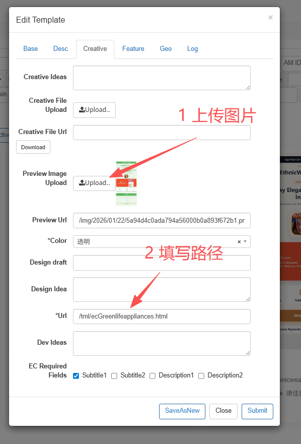
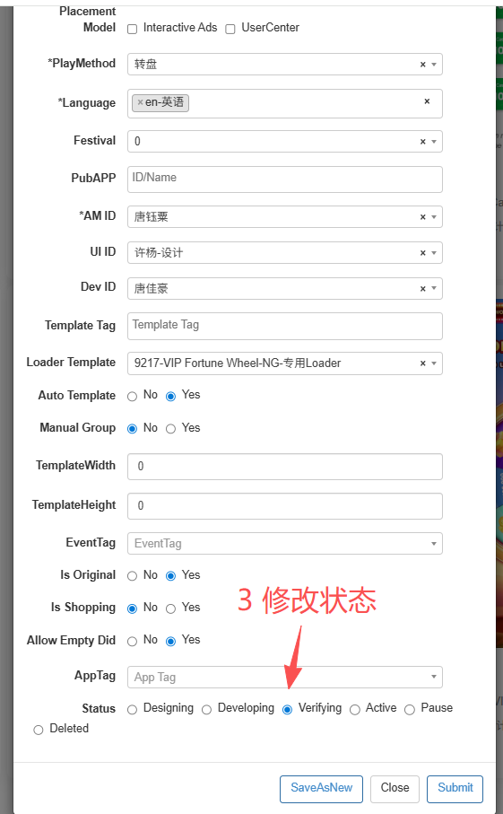

# EndCard（EC）制作

> 目标：新人能独立创建、配置、测试并上线一个 EC 页面。

## 1. EC 制作位置

所有 EC 和玩法一样，都在：

```
E:\Projects\okspin-tml-v2\src\views
```

每个 EC 是一个独立项目目录。

命名规则：

```
ec + 项目名
```

例如：

```
ecDemo
ecReward
```

文件结构与玩法基本一致，根据需求定制实现。

## 2. EC 文案配置规则（非常重要）

👉 **所有 EC 文案必须写在 `build.json`**

原则：

-   EC 页面不允许写死文案
-   所有文本通过 build 配置读取
-   `home.vue` 动态提取 build.json 内容

说明：

第一次确定文案后保存到 build.json，
每次运行只读取最新保存的 build 配置：

👉 **不会热更新**

修改文案后需要重新运行项目。

## 3. EC 核心组件

### 必须引入

```js
import EndCard from "@/util/EndCard";
```

所有跳转交互必须使用：

```js
EndCard.click();
```

### 初始化逻辑（必须写）

```js
onMounted(() => {
	nextTick(async () => {
		const res = await EndCard.ready();
		data.info = { ...res };

		if (res.ec && res.ec.ext) {
			const { ext } = res.ec;
			data.obj = ext?.obj || proxy.$build.obj;
		}
	});
});
```

这是 EC 初始化的标准流程。

### 可选组件（按需求使用）

```js
import ECVideo from "@/components/EcVideo/index.vue";
```

使用方式：

```vue
<ECVideo class="reward-video-section__video" :info="data.info" />
```

ECVideo 用于多图多视频展示，是否使用由需求决定。

## 4. EC 本地测试方法

EC 支持通过 URL 参数注入测试数据，无需依赖真实接口。

### 测试参数

```json
#{"icon":"https://img.adtiming.com/fetch/https://is3-ssl.mzstatic.com/image/thumb/Purple124/v4/3a/42/2a/3a422ab5-a0c6-92d1-cc3d-d22f956aa919/source/512x512bb.jpg","ec":{"id":23,"img":"https://static.admarvel.top/h5/6install/main.jpg","link":"https://joingamestech.com/apk/luckyrummy_Affiliate_40000.apk","title":"EcTitle","subtitles":["sub title part 1","sub title part 2"],"descns":["Description Part 1","Description Part 2"]},"app":{"rating":4.8,"rcount":"5000+","size":"7.8","dls":"5,000,000+","age":"18"}}
```

### 使用示例

本地地址：

```
http://localhost:5173/
```

测试地址：

```
http://localhost:5173/#{"icon":"..."}
```

线上测试方式相同。

### 作用

该参数用于：

-   模拟 EC 数据
-   测试 UI 展示
-   验证跳转逻辑
-   快速排查问题

无需修改代码即可测试。

## 5. 开发完成后的操作

EC 制作完成后必须：

-   压缩图片资源
-   打包项目
-   上传部署

确保：

-   页面无报错
-   文案读取正常
-   跳转交互可用

## 6. Admin 状态修改流程

EC 开发完成后，需要在 **Admin 后台更新模板状态**。

### 第一步：Creative 分类

进入：

```
Edit Template → Creative
```

#### 必做操作：

✅ 上传 **玩法首页 Preview Image**

```
Preview Image Upload → Upload
```

✅ 填写玩法访问路径

```
*Url = /tml/EC路径.html
```

示例：

```
/tml/DiamondScratchCard.html
```



### 第二步：Base 分类

进入：

```
Edit Template → Base
```

将状态修改为：

```
Status → Verifying
```

这是提测阶段的标准状态。



#### Admin 状态流转说明

| 状态          | 含义               |
| ------------- | ------------------ |
| Designing     | 设计中             |
| Developing    | 开发中             |
| **Verifying** | 提测中（必须设置） |
| Active        | 已上线             |
| Pause         | 暂停               |

#### 提测 checklist

在点击 Submit 前确认：

-   [ ] 玩法可正常访问
-   [ ] build.json 配置无误
-   [ ] Preview Image 已上传
-   [ ] Url 路径填写正确
-   [ ] 状态已改为 Verifying

## 7. 新人最低要求

新人必须能：

-   创建 EC 项目目录
-   使用 build.json 配置文案
-   正确接入 EndCard
-   使用 URL 参数进行本地测试
-   完成测试并打包上传
