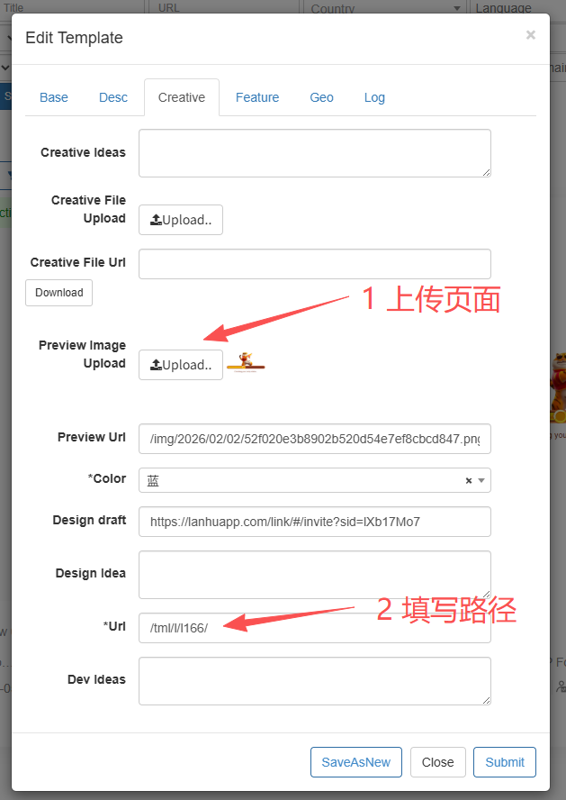
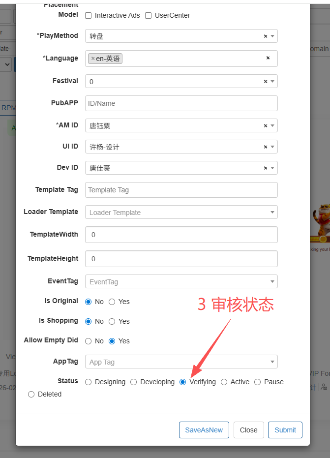

# Loader 制作

> 说明：本文档中的代码块在 VitePress 1.x 会自带 **Copy** 按钮，可一键复制。

## 1. 新增 Loader 目录规则

-   目录位置：`okspin-tml-loader/src/`
-   新增目录：必须以 **l 开头**，编号按现有目录顺序自增  
    例如已有 `l166`，下一个就是 `l167`
-   新增前必须先执行：

```bash
git pull
```

确保仓库为最新版本，避免编号冲突。

## 2. Loader 基础目录结构

每个 Loader 目录保持统一结构：

```text
l167/
├─ css/
├─ img/
├─ js/
└─ index.html
```

## 3. 本地预览（开发）

在 VS Code 中打开 `index.html`，右键：

```text
Open with Live Server
```

即可本地实时预览 Loader。

## 4. Loader 调试方式（带模板入口）

调试 URL 格式：

```text
{端口号}/{文件夹名称}/#/tml/christmasSockTurntableYn.html?v=2305311302#/?pid=10452&ptid=9859&tid=953&jsv=2308011632&did=837659bc-c949-4d5f-acab-9463d808d7c0
```

示例（Live Server 端口 5500，文件夹为 l167）：

```text
http://localhost:5500/l167/#/tml/christmasSockTurntableYn.html?v=2305311302#/?pid=10452&ptid=9859&tid=953&jsv=2308011632&did=837659bc-c949-4d5f-acab-9463d808d7c0
```

说明：

-   `{文件夹名称}` = 你新增的 loader 目录名（如 l167）
-   用于本地完整调试投放参数

## 5. 打包模式（package.json 配置）

### 5.1 新增 build 脚本

在 `okspin-tml-loader/package.json` 的 `scripts` 中新增：

```json
{
	"build-l167": "node lib/pack.js -s l167"
}
```

规则：

-   脚本名：`build-{文件夹名称}`
-   命令：`node lib/pack.js -s {文件夹名称}`

### 5.2 执行打包

```bash
yarn build-l167
```

## 6. 上传发布（生产环境）

打包完成后执行：

```bash
yarn deploy-prod
```

该命令会自动上传到生产服务器。

## 7. Admin 状态修改流程（Loader 提测必做）

Loader 制作完成并上传后，需要在 Admin 后台更新项目状态。


### Step 1：Creative 分类上传预览图

进入 Admin 编辑页面：

```
Creative → Preview Image Upload
```

点击上传按钮，上传 Loader 的预览图。

要求：

-   图片清晰
-   能体现 Loader 主要内容
-   尺寸符合后台规范

### Step 2：填写访问路径

在 Creative 分类下：

```
*Url
```

填写 Loader 访问路径，例如：

```text
/tml/l166/
```

说明：

-   填写你实际的 Loader 文件夹路径
-   必须与服务器路径一致



### Step 3：修改 Base 分类状态

进入：

```
Base → Status
```

将状态调整为：

```text
Verifying
```

表示：

-   项目进入测试验证阶段
-   等待运营/测试确认



### Admin 修改完成后的检查

确认以下三项：

-   Preview 图片已上传
-   Url 路径填写正确
-   Status 已改为 Verifying

完成后即可通知测试或运营验证。

## 8. 新人快速流程总结

```text
git pull
↓
新建 lXXX 目录
↓
Live Server 本地调试
↓
修改 package.json 新增 build-lXXX
↓
yarn build-lXXX
↓
yarn deploy-prod
↓
填写admin 信息

```
